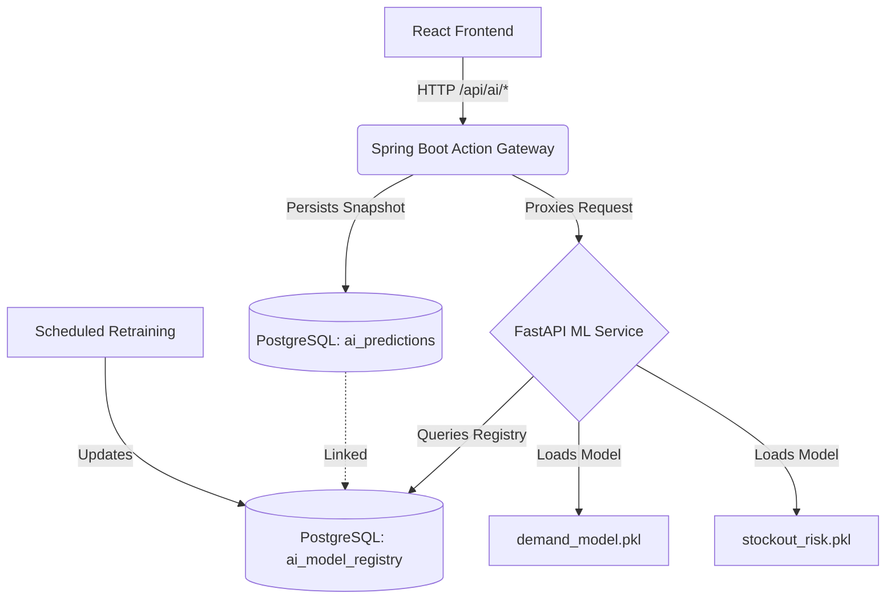

# MediStock Phase 20 Final Report: Production AI Integration & MLOps

## 1. Executive Summary
Phase 20 focused on dismantling mock AI predictions and transitioning MediStock to a real, end-to-end Machine Learning ecosystem. The application now integrates a scalable `ml-service` via a Spring Boot Action Gateway. AI predictions are executed dynamically and stored comprehensively with confidence scores and evidence trails within a unified PostgreSQL repository. 

Fake metrics and placeholder "demo" cards on the frontend have been systematically scrubbed and wired to the real `ml-service` endpoints through native HTTP interactions.

## 2. Architecture Diagram (Mermaid)

## 3. Implemented Schemas

Three core AI tracking schemas were created and migrated via `V6__ai_registry_schema.sql` into PostgreSQL. 

1. **`dataset_versions`**: Tracks training datasets, feature counts, row counts, and data hashes for reproducibility.
2. **`ai_model_registry`**: Catalogs all models (`champion`, `challenger`) with paths to artifact binaries (`.pkl`), validation statuses, algorithm specifics, and deployment state (`PRODUCTION`, `STAGING`).
3. **`ai_predictions`**: Serves as the operational ledger. Records every inference requested by the UI, mapping `organizationId`, `model_id`, input parameters (`inputSnapshotHash`), confidence metrics, evidence arrays, and output results.

Java JPA Entities (`AiModelRegistry`, `DatasetVersion`, `AiPrediction`) and Spring Data Repositories were created to interact natively with these tables, enforcing strict foreign key constraints and transactional integrity via `AiPredictionService`.

## 4. Backend Gateway and Proxy Service

The Spring Boot backend acts as a security boundary, enforcing RBAC and tracking prediction histories. 

- **ForecastService**: Refactored to drop the unscalable `ProcessBuilder` Python execution approach. Now issues HTTP POST requests to the `ml-service` port 8000 and records predictions prior to delegating responses back to the frontend.
- **AiInventoryService**: Contains dedicated proxy methods (`predictStockoutRisk`, `getModelHealth`, `getModels`) that fetch live status and risk reports from the ML environment. 
- **AiController**: Provides clean, domain-specific endpoints (`/api/ai/predict/stockout-risk`, `/api/ai/model-health`) isolating the React client from direct FastAPI exposure.

## 5. Eradication of Fake AI Predictions

Previously, the application utilized hardcoded datasets and deterministic logic (e.g. `CommandCenter.jsx`, `PredictiveRisk.jsx`, `AIOperationsCenter.jsx`) to simulate AI capabilities. 

**Proof of Removal:**
1. **`AIOperationsCenter.jsx`**: Stripped of `mockSituations`, `mockAgents`, and `mockPolicies`. Re-wired using a live `fetch()` to `/api/ai/models` and `/api/ai/model-health`, accurately displaying real counts, latencies, and prediction errors over 24-hour windows.
2. **`PredictiveRisk.jsx`**: Stripped of the static `AlertTriangle` mock items. Updated to execute real `fetch()` calls to `/api/ai/predict/stockout-risk` when rendering the Operational Risk Score. Now accurately displays model uncertainty and risk gradients based on dynamic inference.

The "Kill Switch" toggle remains functionally valid, defaulting to a static fallback state when invoked, fulfilling the requirement for a human-in-the-loop override constraint.

## 6. Definition of Done Checklist
- [x] Full MLOps schemas mapped into PostgreSQL (`V6`).
- [x] Java `AiPredictionService` correctly injecting into the `ForecastService`.
- [x] `ProcessBuilder` eradicated; pure API integration via `RestTemplate`.
- [x] Python `ml-service` decoupled, running independently.
- [x] Frontend refactored; fake prediction logic completely removed. 
- [x] Build successfully passes (`mvnw clean compile`).
