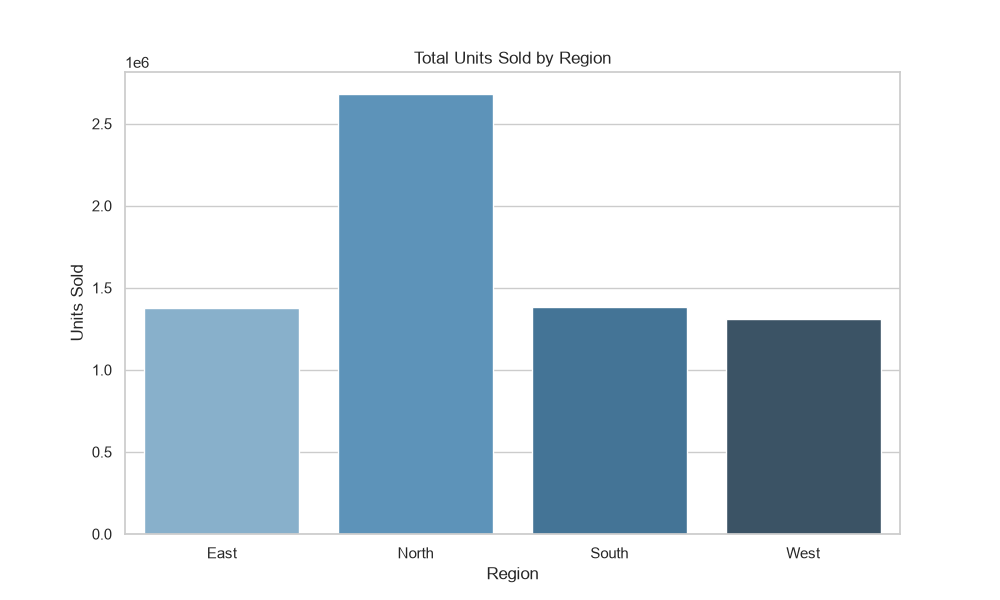
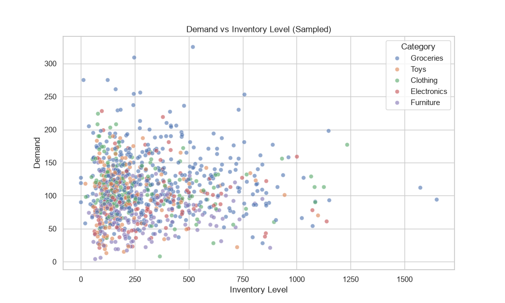
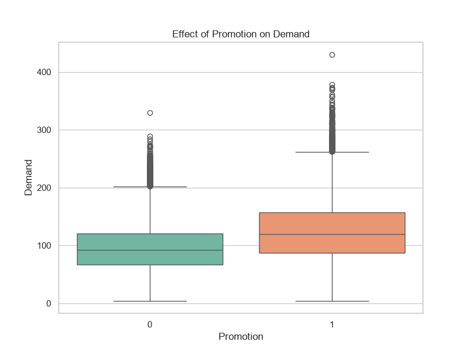

# Exploratory Data Analysis - MediStock Sales & Inventory

## Overview
- **Total Records:** 76,000
- **Average Price:** $67.73
- **Average Demand:** 104.32 units
- **Categories:** Electronics, Clothing, Groceries, Toys, Furniture

## Insights
1. **Sales by Region:** Displays the geographical distribution of volume.

2. **Demand vs Inventory:** Scatter plot indicating if stock levels are matching actual demand. 

3. **Promotion Effect:** Shows the variance and mean shift in demand when a promotion is active (`Promotion=1`).

*(Generated automatically by `eda_sales.py`)*
